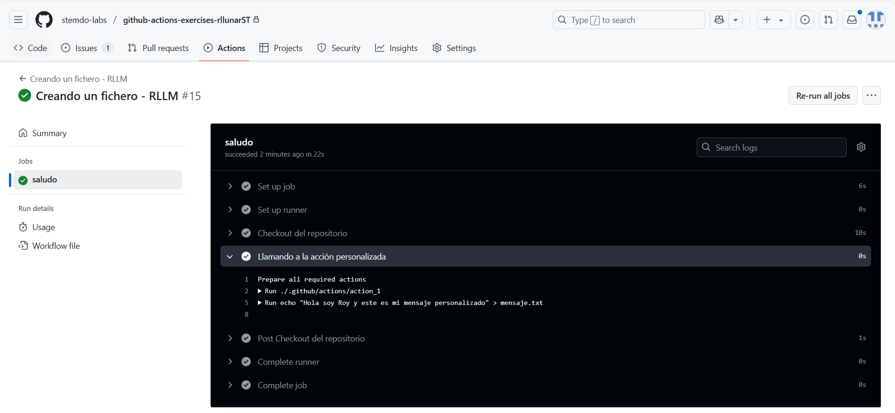

# Actions - Ejercicio 1

## Crear una action personalizada que sea capaz de crear un archivo de texto en el directorio raíz del repositorio con un mensaje

Para este ejercicio debemos crear un action personalizado, este fichero lo creare en la carpeta `.github/actions/action_1` y lo llamaremos `action.yml`. Este fichero contendrá la configuración de la action.

```yaml
name: Action - Crear un fichero de texto - RLLM
 
inputs:
  mensaje:
    description: El contenido que tendrá el archivo
    required: true
 
runs:
  using: "composite"
  steps:
    - name: Creando fichero mensajeActionRLLM.txt
      run: echo "${{ inputs.mensaje }}" > mensajeActionRLLM.txt
      shell: bash
```

Como podemos ver en el código anterior, la action tiene un input llamado `mensaje` que es el contenido del archivo. En la sección `runs` se define que se va a ejecutar un script en bash que creará un archivo llamado `mensaje.txt` con el contenido del input `mensaje`.

Ahora definimos el workflow que ejecutará la action. Este fichero lo llamaremos `action_1.yml` y tendrá el siguiente contenido.

```yaml
name:  Creando un fichero - RLLM
 
on:
  workflow_dispatch:
 
jobs:
  saludo:
    runs-on: labs-runner
    steps:
      - name: Checkout del repositorio
        uses: actions/checkout@v4
 
      - name: Llamando a la acción personalizada
        uses: ./.github/actions/action_1
        with:
          mensaje: "Hola soy Roy y este es mi mensaje personalizado"
```

Como podemos ver este workflow tiene un paso llamado `uses` que llama a la action personalizada que hemos creado anteriormente y con el paso `with` le pasamos al input del action el mensaje que queremos que contenga el archivo. En este caso el mensaje es "Hola soy Roy y este es mi mensaje personalizado".

Si ejecutamos ahora el workflow podemos ver su funcionamiento. 

