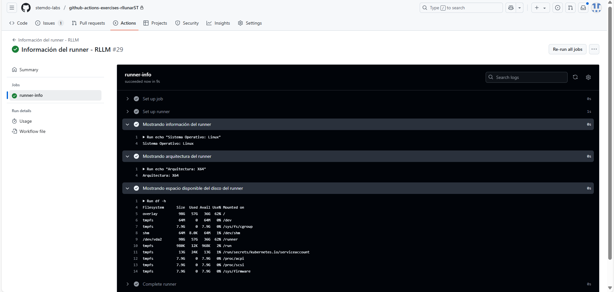

# Contexts - Ejercicio 1

## Configura un workflow que imprima información sobre el runner en el que se está ejecutando el job, como el nombre del sistema operativo, la arquitectura, y el espacio en disco disponible

Crearemos primero que nada el workflow que usará el runner que escojamos para obtener la infomración que queremos mostrar.

```yaml
name: "Información del runner - RLLM"

on:
  workflow_dispatch:
 
jobs:
  runner-info:
    runs-on: labs-runner
    steps:
      - name: Mostrando información del runner
        shell: bash
        run: |
          echo "Sistema Operativo: ${{ runner.os }}"
     
      - name: Mostrando arquitectura del runner
        shell: bash
        run: |
          echo "Arquitectura: ${{ runner.arch }}"
 
      - name: Mostrando espacio disponible del disco del runner
        shell: bash
        run: df -h
```

Como podemos observar en nuestro workflow usamos las variables de contexto `RUNNER_OS`, `RUNNER_ARCH` y el comando `df -h` para mostrar la información que deseamos mostrar del runner.

El resultado de la ejecución del workflow es el siguiente:



Con esto ya obtuvimos la información del runner en el que se está ejecutando el job como solicita el ejercicio.
