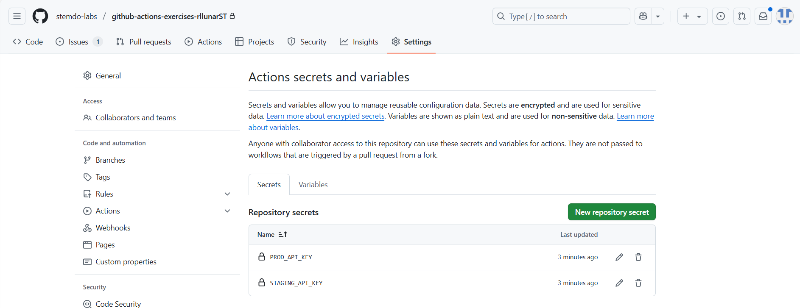
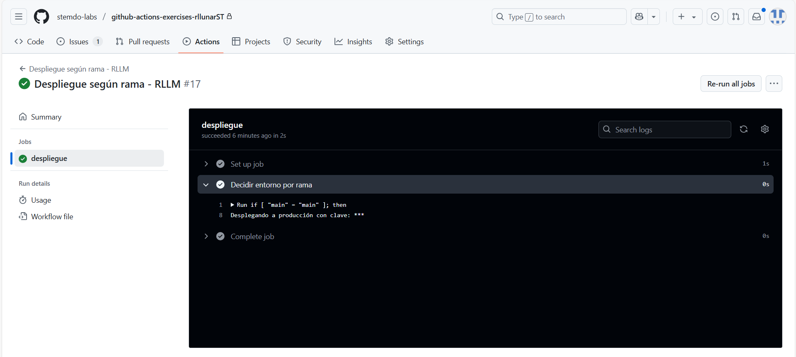
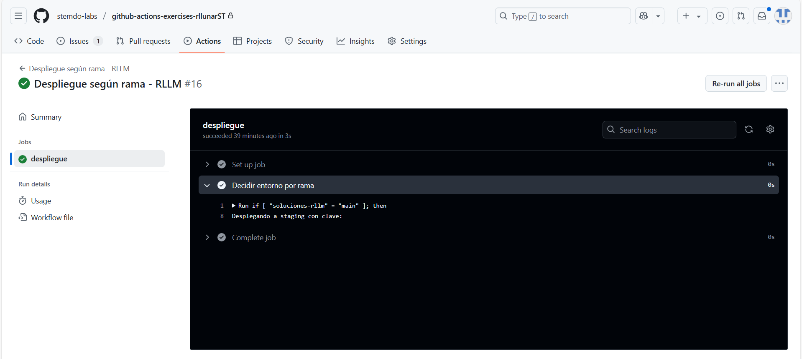

# Contexts - Ejercicio 2

## Configura un workflow que utilice un secreto llamado PROD_API_KEY para realizar un despliegue ficticio si se ejecuta en la rama main, y otro secreto llamado STAGING_API_KEY para cualquier otra rama

**El workflow debería:**

- Utilizar el contexto secrets para inyectar la API Key correspondiente en un comando de despliegue ficticio.
- Imprimir un mensaje indicando cuál API Key se utilizó.

Para realizar este ejercicio, puedes utilizar el siguiente código como base:

```yaml
name: "Despliegue según rama - RLLM"

on:
  workflow_dispatch:

jobs:
  despliegue:
    runs-on: ubuntu-latest

    steps:
      - name: Checkout del repositorio
        uses: actions/checkout@v4

      - name: Decidir entorno por rama
        shell: bash
        run: |
          if [ "${{ github.ref_name }}" = "main" ]; then
            echo "Desplegando a producción con clave: ${{ secrets.PROD_API_KEY }}"
          else
            echo "Desplegando a staging con clave: ${{ secrets.STAGING_API_KEY }}"
          fi
```

Como podemos ver en el código, se utiliza el contexto `github.ref_name` para comprobar en que rama se ejecuta esteworkflow, si la rama es main se muestra el mensaje de producción, si no se muestra el mensaje de staging.

Para poder realizar el ejercicio, se deben utilizar los secretos `PROD_API_KEY` y `STAGING_API_KEY` que se deben crear en la sección de secretos del repositorio. En mi caso me toca crearlos, a continuación muestro los secretos ya creados:



Ahora si ejecutamos el workflow podemos ver el siguiente resultado:

### Resultado para la rama 'main'




Como podemos ver el mensaje de producción se muestra correctamente, pero el secreto no se muestra ya que este es un secreto y los secretos no se pueden mostrar por consola al ejecutar el workflow.

### Resultado para la rama 'soluciones-rllm'



Como podemos ver el mensaje de staging se muestra correctamente pero este tampoco se muestra al igual que el anterior por el mismo motivo.