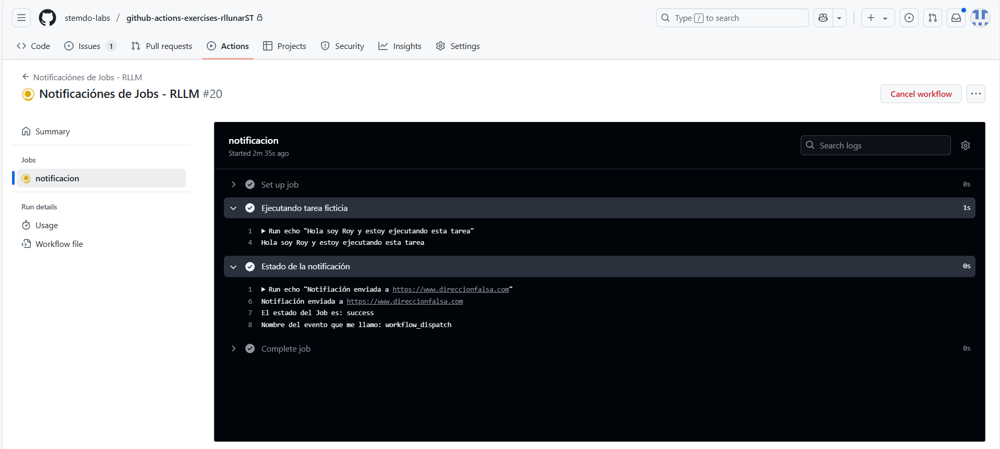

# Contexts - Ejercicio 3

## Configura un workflow que realice una tarea ficticia y luego envíe un mensaje de notificación a una URL (simulada con echo) usando el estado del job y el nombre del evento que lo desencadenó

Para hacer este ejercicio, vamos a crear un workflow que imprima por consola con un `echo` un mensaje definido y luego definimos otra tarea que imprima con `echo` un mensaje con una URL, el nombre del evento que lo desencadenó y el estado del job. Para ello, vamos a usar la variable de contexto `github.event_name` y `github.job.status`.

```yaml
name: "Notificaciónes de Jobs - RLLM"

on:
  workflow_dispatch:

jobs:
  notificacion:
    runs-on: ubuntu-latest

    steps:
      - name: Ejecutando tarea ficticia
        run: echo "Hola soy Roy y estoy ejecutando esta tarea"

      - name: Estado de la notificación
        run: |
          echo "Notifiación enviada a https://www.direccionfalsa.com"
          echo "El estado del Job es: ${{ job.status }}"
          echo "Nombre del evento que me llamo: ${{ github.event_name }}"
```

Podemos ver el resultado de la ejecución de este workflow en la pestaña de `Actions` de nuestro repositorio.



Como podemos ver en la imagen, el workflow se ejecuta correctamente y nos imprime la URL, el estado del job y el nombre del evento que lo desencadenó.