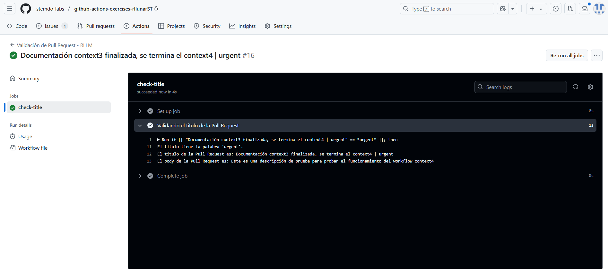
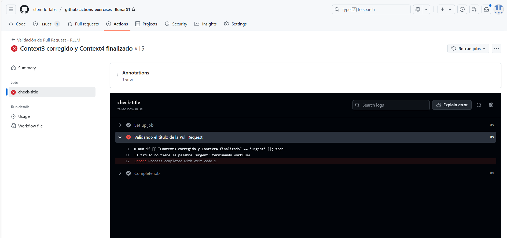

# Contexts - Ejercicio 4

## Configura un workflow que se ejecute cuando se abra una pull_request. El workflow debería verificar si el título del pull request contiene una palabra clave específica (urgent). Si la palabra se encuentra en el título, imprime el título y cuerpo de la PR, si la palabra no se encuentra en el título, haz que la ejecución falle.

Para hacer este ejercicio crearemos un workflow que se ejecute a la hora de abrir una pull request luego comprueba si el título contiene la palabra 'urgent', en caso de que la contenga imprimiremos con un `echo` el cuerpo y titulo de nuestra pull request. El contenido de mi workflow será el siguiente:

```yaml
name: "Validación de Pull Request - RLLM"

on:
  pull_request:
    types: [opened]

jobs:
  check-title:
    runs-on: ubuntu-latest
    steps:
      - name: Validando el titulo de la Pull Request
        run: |        
          if [[ "${{ github.event.pull_request.title }}" == *urgent* ]]; then
            echo "El título tiene la palabra 'urgent'."
            echo "El titulo de la Pull Request es: ${{ github.event.pull_request.title }}"
            echo "El body de la Pull Request es: ${{ github.event.pull_request.body }}"
          else
            echo "El título no tiene la palabra 'urgent' terminando workflow"
            exit 1
          fi
```

Ahora si hacemos un pull request de prueba que contenga la palabra 'urgent' en el título, podemos ver el resultado de la ejecución de este workflow en la pestaña de `Actions` de nuestro repositorio.



Como podemos ver en la imagen, si el título de la pull request contiene la palabra 'urgent' el workflow se ejecuta correctamente y nos imprime el título y cuerpo de la pull request.



Como podemos ver en la imagen, si el título de la pull request no contiene la palabra 'urgent' el workflow falla.