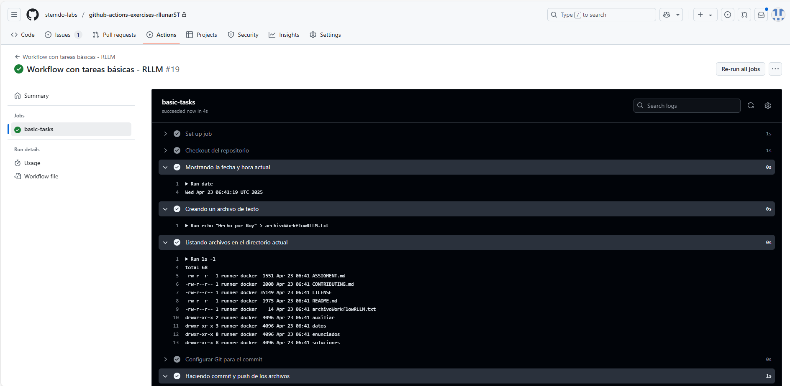
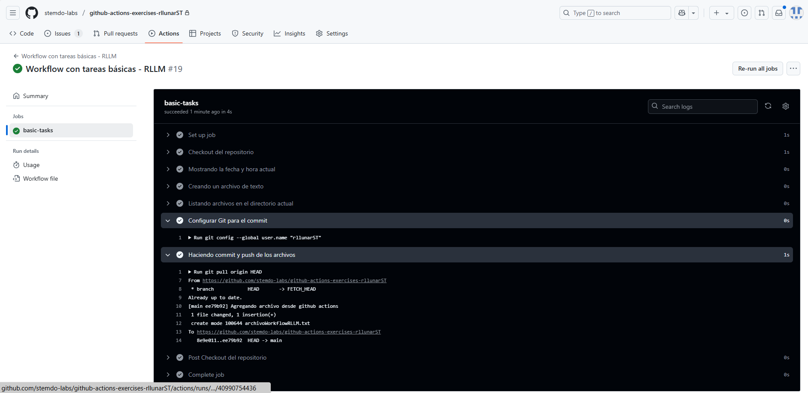
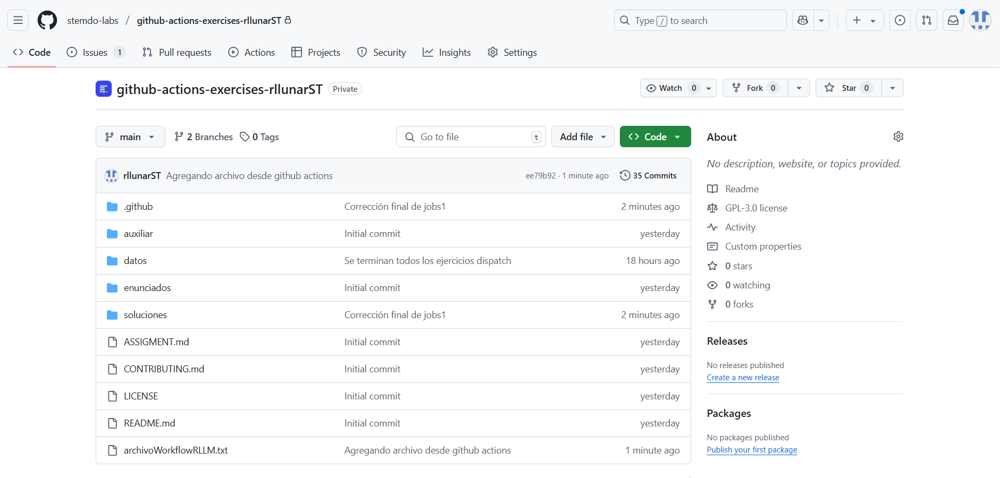

# Jobs y Steps - Ejercicio 1

## Configura un workflow (workflow_dispatch) con un solo job que haga las siguientes tareas:

- Mostrar la fecha y hora actual.
- Crear un archivo de texto.
- Listar los archivos en el directorio actual.
- Hacer un commit y push de cualquier fichero en el repositorio.

Para este ejercicio creare un nuevo workflow de tipo `.yaml` este fichero se llamará `jobs_1.yaml` y estará ubicado en la carpeta `.github/workflows/`. El contenido del workflow será el siguiente:

```yaml
name: "Workflow con tareas básicas - RLLM"

permissions:
  contents: write

on:
  workflow_dispatch:

jobs:
  basic-tasks:
    runs-on: ubuntu-latest

    steps:
      - name: Checkout del repositorio
        uses: actions/checkout@v3

      - name: Mostrando la fecha y hora actual
        run: date

      - name: Creando un archivo de texto
        run: echo "Hecho por Roy" > archivoWorkflowRLLM.txt

      - name: Listando archivos en el directorio actual
        run: ls -l

      - name: Configurar Git para el commit
        run: |
          git config --global user.name "rllunarST"
          git config --global user.email "rllunar@stemdo.io"

      - name: Haciendo commit y push de los archivos
        run: |
          git pull origin HEAD
          git add archivoWorkflowRLLM.txt
          git commit -m "Agregando archivo desde github actions"
          git push origin HEAD
```

Como podemos ver en el workflow que creamos se usa permisos para poder hacer un commit y push al repositorio. En este caso se le da permisos de escritura a los contenidos del repositorio.

Luego para poder hacer un commit y push de los archivos se configura el usuario y el correo electrónico de git. Esto es necesario para que git pueda identificar al autor del commit. En este caso se usa el nombre de usuario y el correo electrónico del autor del commit. Luego se hace un pull del repositorio para asegurarse de que se tiene la última versión del repositorio antes de hacer el commit y push. Finalmente, se hace un commit y push del archivo creado. A la rama `HEAD` del repositorio.

Ahora ejecutaremos el workflow para ver que inician las tareas que definimos del job como veremos en la siguiente imagen:





Como podemos ver se ejecutaron todas las tareas que definimos en el job sin problemas. En la siguiente imagen podemos ver el commit que se hizo al repositorio:



Como podemos ver el commit se realizó perfectamente en nuestro repositorio demostrando que con github actions podemos automatizar tareas como lo es un commit de forma rapida y sencilla.