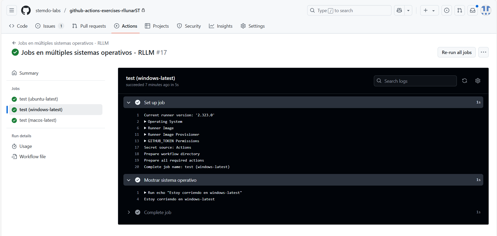

# Jobs y Steps - Ejercicio 3

## Configura un workflow que ejecute el mismo job en diferentes sistemas operativos

Para este ejercicio crearemos un nuevo workflow que contendrá una matriz con la intención de definir varios entornos y en base a esto ejecutar el mismo job en diferentes sistemas operativos. El contenido del workflow será el siguiente:

```yaml
name: "Jobs en múltiples sistemas operativos - RLLM"

on:
  workflow_dispatch:

jobs:
  test:
    runs-on: ${{ matrix.os }}
    strategy:
      matrix:
        os: [ubuntu-latest, windows-latest, macos-latest]

    steps:
      - name: Mostrar sistema operativo
        run: echo "Estoy corriendo en ${{ matrix.os }}"
```

Ahora que tenemos el workflow configurado, vamos a proceder a ejecutarlo desde las Actions de nuestro repositorio para ver su funcionalidad.


Como podemos observar tenemos una matriz con tres sistemas operativos diferentes y el job se ejecutará en cada uno de ellos. Si abrimos cada uno podemos ver su ejecución.




Como vemos en las imagenes cada job corre en un sistema operativo distinto y muestra el mensaje correspondiente.
