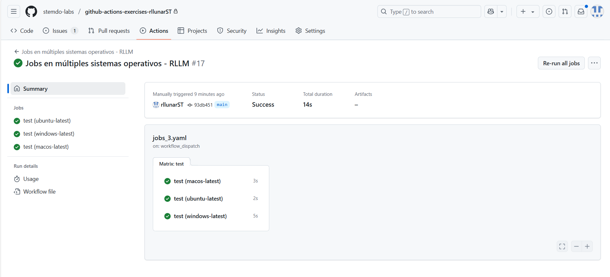
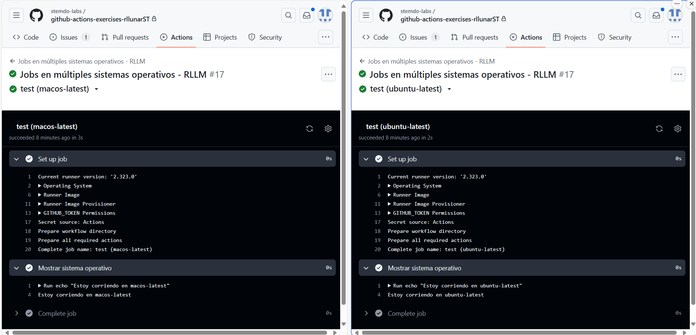

# Jobs - Ejercicio 4

## 1. Crea un job el cual cree un archivo .txt llamado "test"

## 2. Crea otro job que mueva el archivo creado anteriormente a otro directorio. ¿Qué es lo que ocurre?

### ¿Qué ocurre?

Para este ejercicio creamos un workflow nuevo que ejecutará 2 jobs distintos, en el primero creará el fichero y en el segundo 

```yaml
name: "Compartiendo archivos entre jobs - RLLM"

on:
  workflow_dispatch:

jobs:
  crear-archivo:
    runs-on: ubuntu-latest
    steps:
      - name: Creando el archivo de prueba
        run: echo "Este es un fichero de prueba de Roy" > test.txt

  mover-archivo:
    runs-on: ubuntu-latest
    steps:
      - name: Moviendo el archivo
        run: mv test.txt testMovido.txt
```

Ahora lo ejecutamos en githubs actions dentro de nuestro repositorio:



Como podemos ver el primer job se ejecuta correctamente pero el segundo no. Si abrimos cada jobs podemos ver esa información en la consola.



Ahora como podemos observar el error nos da la pista que es que el archivo no existe. Esto es porque cada job se ejecuta en un contenedor diferente y por lo tanto no comparten el mismo espacio de trabajo. Por lo que si queremos mover el fichero debemos hacerlo dentro del mismo job.