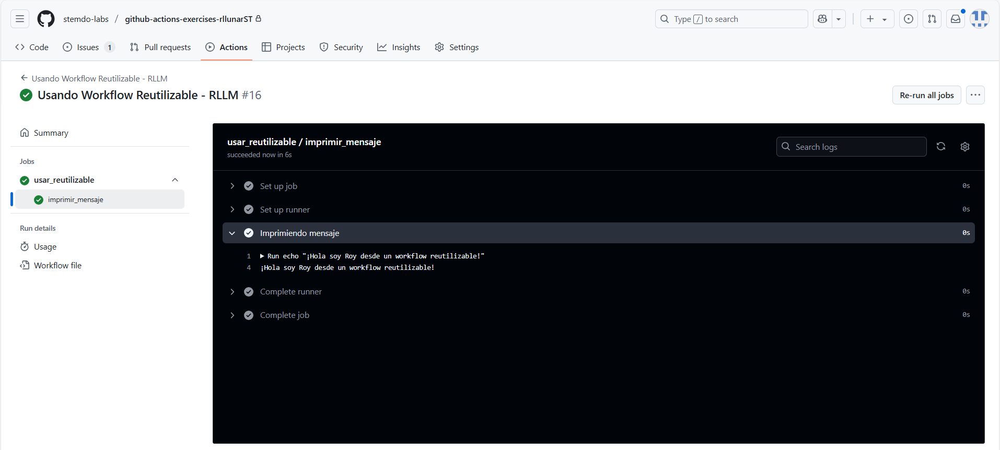

# Workflows reusables - Ejercicio 1

## Configura un workflow reutilizable que simplemente imprima un mensaje

## Luego, crea otro workflow que use ese workflow reutilizable

Para hacer los workflows reutilizables debemos crear un nuevo fichero `.yaml` que contenga un trigger que se llama `workflow_call`. Este trigger nos permite que el workflow se pueda llamar desde un workflow externo.

Este es el contenido del workflow reutilizable:

```yaml
name: "Workflow Reutilizable - RLLM"

on:
  workflow_call:

jobs:
  imprimir_mensaje:
    runs-on: labs-runner
    steps:
      - name: Imprimiendo mensaje
        run: echo "¡Hola soy Roy desde un workflow reutilizable!"
```	

Ahora simplemente debemos crear el workflow que llame al workflow reutilizable este workflow tendrá un trigger `workflow_dispatch` para que podamos ejecutarlo manualmente y en sus jobs llamaremos al workflow reutilizable que hemos creado anteriormente. El contenido del workflow que llama al workflow reutilizable es el siguiente:

```yaml
name: "Usando Workflow Reutilizable - RLLM"

on:
  workflow_dispatch:

jobs:
  usar_reutilizable:
    uses: ./.github/workflows/reutilizable.yaml
```

Si lo ejecutamos ahora veremos el siguiente resultado:



Como podemos ver, el workflow reutilizable se ha ejecutado correctamente y se imprimió dentro del workflow que lo llama el mensaje.