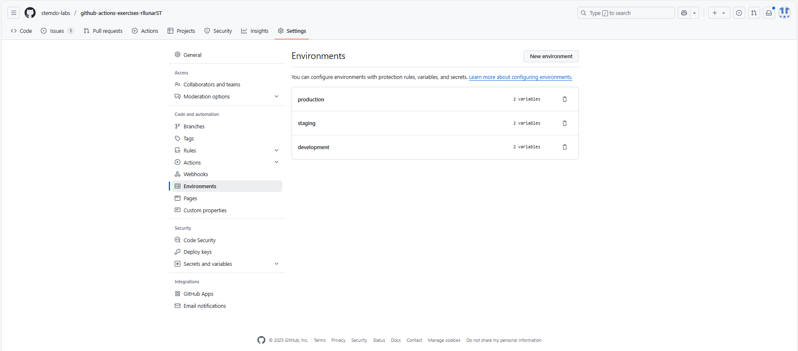
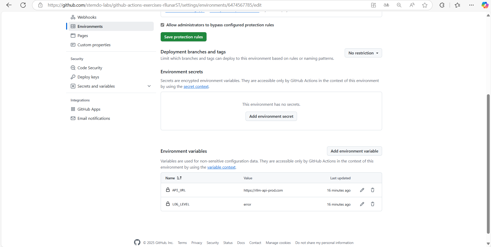
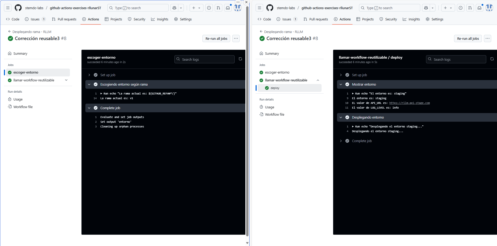
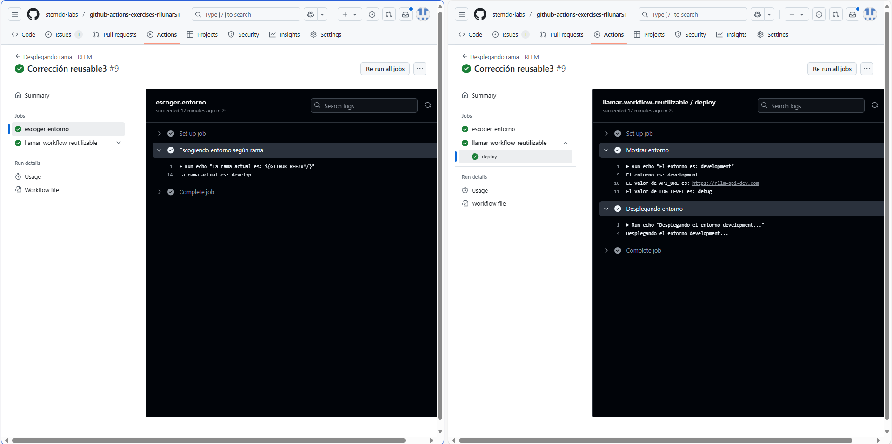
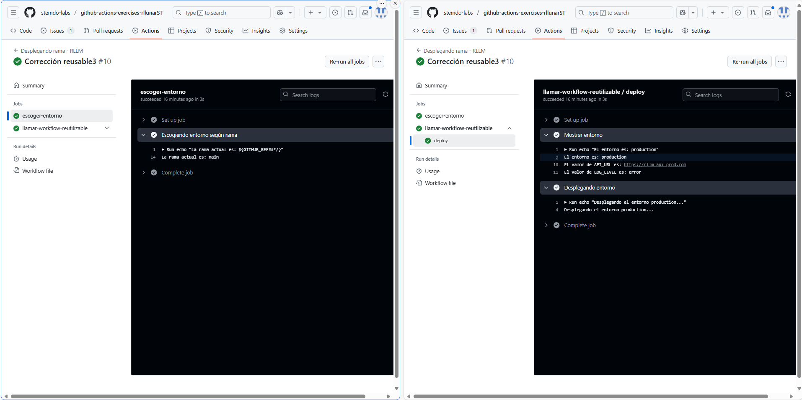

# Workflows reusables - Ejercicio 3

## En este ejercicio, configurarás un workflow reutilizable (deploy-environment.yml) que realizará tareas de despliegue basadas en un entorno específico.

## Este workflow reutilizable será lladmao por otro workflow (trigger-deploy.yml) que se ejecutará automáticamente en función de la rama en la que se realice el push o mediante ejecución manual.

Cada entorno (development, staging, production) tendrá configuradas sus propias variables de entorno y secretos en GitHub, los cuales serán utilizados automáticamente por el workflow correspondiente.

Para este ejercicio se utilizarán dos repositorios, uno público, y el repositorio privado en el que se ha estado trabajando.

## Paso a paso:

> 1. Configuración de Environments en GitHub:
>
> - En el repositorio público, ve a Settings > Environments.
> - Crea tres environments: development, staging, y production.
> - Configura variables de entorno específicas para cada environment, como:
>   - API_URL
>   - LOG_LEVEL
> Estas variables de entorno tendrán valores diferentes dependiendo del environment seleccionado.

[Administración de entornos en GitHub](https://docs.github.com/es/actions/managing-workflow-runs-and-deployments/managing-deployments/managing-environments-for-deployment)

> 2. Definir el Workflow Reutilizable:
>
> Crea un archivo llamado deploy-environment.yml en el directorio .github/workflows/.
> Este workflow reutilizable recibirá un input llamado environment, el cual determinará el environment de despliegue.

> 3. Definir el Workflow que Invoca al Reusable:
>
> Crea un archivo llamado trigger-deploy.yml en el directorio .github/workflows/.
> Este workflow se activará en función de las ramas (main, develop, release/*) y llamará al workflow reutilizable para desplegar en el entorno correspondiente.

## Solución:

Para esta actividad debemos crear tres enviroments, esto lo haremos volviendo nuestro repositorio público, y creando tres entornos en la sección de settings del repositorio. En este caso, los entornos serán development, staging y production.



Y dentro de cada entorno creamos las variables de entorno necesarias para el despliegue. En este caso, crearemos las variables API_URL y LOG_LEVEL.



Ahora que tenemos los entornos creados debemos ahora crear el workflow reusable que mostrará las variables de entorno según el entorno que se le pase como parámetro, el workflow lucirá de la siguiente manera:

```yaml
name: "Seleccionar entorno (Reusable) - RLLM"

on:
    workflow_call:
      inputs:
        environment:
          required: true
          type: string

  jobs:
    deploy:
      runs-on: labs-runner
      environment: ${{ inputs.environment }}
  
      steps:
        - name: Mostrar entorno
          run: |
            echo "El entorno es: ${{ inputs.environment }}"
            echo "EL valor de API_URL es: $API_URL"
            echo "El valor de LOG_LEVEL es: $LOG_LEVEL"
          env:
            API_URL: ${{ vars.API_URL }}
            LOG_LEVEL: ${{ vars.LOG_LEVEL }}
  
        - name: Desplegando entorno
          run: echo "Desplegando el entorno ${{ inputs.environment }}..."
```

Ahora crearemos el workflow que invocará al reusable, este workflow se llamará trigger-deploy.yml y lucirá de la siguiente manera:

```yaml
name: "Desplegando rama - RLLM"

on:
  push:
    branches:
      - main
      - develop
      - 'release/*'
  workflow_dispatch:

jobs:
  escoger-entorno:
    runs-on: labs-runner

    outputs:
      entorno: ${{ steps.seleccion.outputs.entorno }}

    steps:
      - name: Escogiendo entorno según rama
        id: seleccion
        run: |
          echo "La rama actual es: ${GITHUB_REF##*/}"
          if [[ "${GITHUB_REF##*/}" == "main" ]]; then
            echo "entorno=production" >> $GITHUB_OUTPUT
          elif [[ "${GITHUB_REF##*/}" == "develop" ]]; then
            echo "entorno=development" >> $GITHUB_OUTPUT
          elif [[ "${GITHUB_REF#refs/heads/}" == release/* ]]; then
            echo "entorno=staging" >> $GITHUB_OUTPUT
          else
            echo "La rama que escogiste no es válida para el despliegue."
            exit 1
          fi

  llamar-workflow-reutilizable:
    needs: escoger-entorno
    uses: ./.github/workflows/deploy-environment.yml
    with:
      environment: ${{ needs.seleccionar-entorno.outputs.entorno }}
```

Como podemos ver en el workflow definimos una variable de output llamada entorno que se encarga de almacenar el entorno escogido para pasarselo como input al workflow reusable, luego de eso llamamos al workflow reusable y le pasamos el entorno como input. 

Guardaremos ahora los cambios y probaremos el workflow para ver si funciona correctamente, el resultado los veremos en las siguientes imagenes:

### Resultado para la rama release/v1:

Si hacemos un push a la rama release/v1, el workflow se ejecutará y llamará al reusable con el entorno staging.



Como podemos ver nos muestra el entorno staging y las variables de entorno que son la url y el log level.

### Resultado para la rama develop:



Si hacemos un push a la rama develop, el workflow se ejecutará y llamará al reusable con el entorno development y veremos los valores definidos para ese entorno.

### Resultado para la rama main:



Por ultimo este entorno es el de producción, y como podemos ver nos muestra los valores definidos para ese entorno.

Como podremos ver los workflow funcionan correctamente y nos permiten desplegar entornos y usar variables de entorno según la rama en la que hayamos hecho un push este workflow ignorará las ramas que no se encuentran en la lista de ramas disponibles para el despliegue y en caso que se ejecute manualmente dará error si no se le pasa un entorno válido.