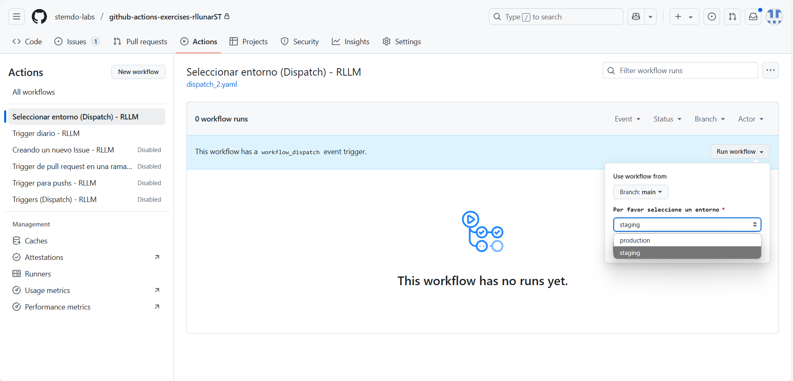
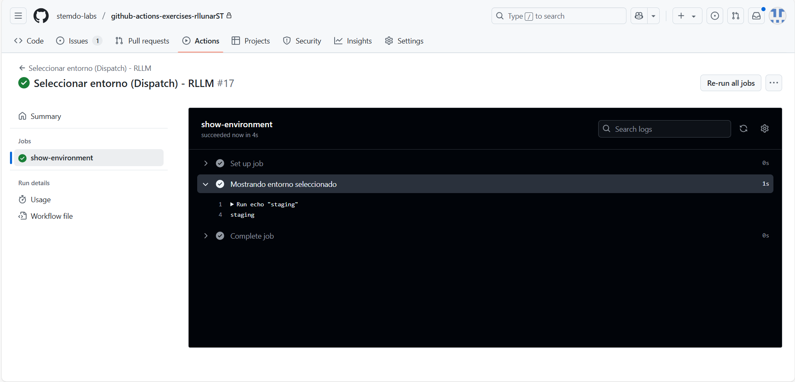

# Triggers (Dispatch) - Ejercicio 2

## 1. Configura un workflow para que se ejecute manualmente usando el evento workflow_dispatch.

## 2. Define un input llamado "_environment_" que permita seleccionar entre "_production_" y "_staging_".

## 3. Imprime el entorno seleccionado en la consola.

Crearemos el workflow `ejercicio2.yaml` en la carpeta de worlflows y este fichero tendrá el siguiente contenido:

```yaml
name: "Seleccionar entorno (Dispatch) - RLLM"

on:
  workflow_dispatch:
    inputs:
      environment:
        description: "Por favor seleccione un entorno"
        required: true
        type: choice
        options:
          - production
          - staging
        default: staging

jobs:
  show-environment:
    runs-on: ubuntu-latest

    steps:
      - name: Mostrando entorno seleccionado
        run: echo "EL entorno seleccionado: ${{ github.event.inputs.environment }}"
```

Ahora, al ejecutar el workflow manualmente, se nos presentará una opción para seleccionar entre los entornos "production" y "staging". Dependiendo de la opción seleccionada, se imprimirá el entorno correspondiente en la consola. Podemos ver desde actions el workflow para iniciarlo manualmente y seleccionar el entorno.



Ahora podemos ver el resultado del workflow y el entorno seleccionado:

