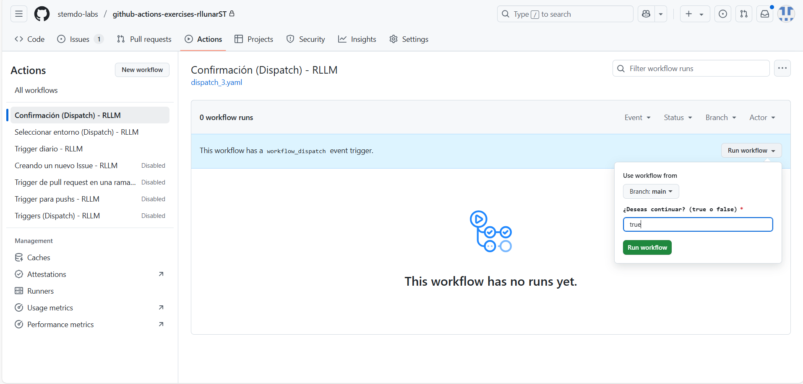
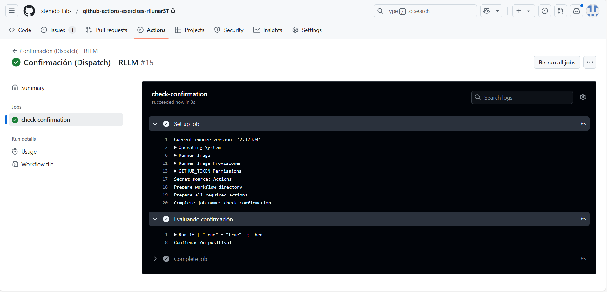

# Triggers (Dispatch) - Ejercicio 2

## 1. Configura un workflow para que se ejecute manualmente usando el evento workflow_dispatch.

## 2. Define un input llamado _"confirm"_ que requiera una _confirmación_ ("true" o "false").

## 3. Imprime un mensaje, dependiendo de si la confirmación es positiva o negativa.

Para este ejercicio, se requiere crear un workflow que se ejecute manualmente y que incluya un input para confirmar la ejecución. Dependiendo de la respuesta, se imprimirá un mensaje diferente. El workflow será el siguiente:

```yaml
name: "Confirmación (Dispatch) - RLLM"

on:
  workflow_dispatch:
    inputs:
      confirm:
        description: "¿Deseas continuar? (true o false)"
        required: true
        default: "false"

jobs:
  check-confirmation:
    runs-on: ubuntu-latest

    steps:
      - name: Evaluando confirmación
        run: |
          if [ "${{ github.event.inputs.confirm }}" = "true" ]; then
            echo "Confirmación positiva!"
          else
            echo "Confirmación negativa!"
          fi
```

Como podremos ver en el 'steps' del job, se evalúa el input `confirm` con un condicional `if`. Dependiendo de si el input es `true` o `false`, se imprimirá un mensaje diferente en la consola.

Ahora probaremos el workflow, lo subiremos a nuestro repositorio y en el apartado de Github Actions lo iniciaremos manualmente, veremos que ahora podemos confirmar el workflow. Podemos verlo en la siguiente imagen:



Ahora una vez que lo ejecutamos, podemos ver el resultado en la consola de ejecución del workflow.



Con esto podemos ver que el workflow se ejecuta correctamente y dependiendo de la confirmación que le demos, se imprimirá un mensaje distinto.

