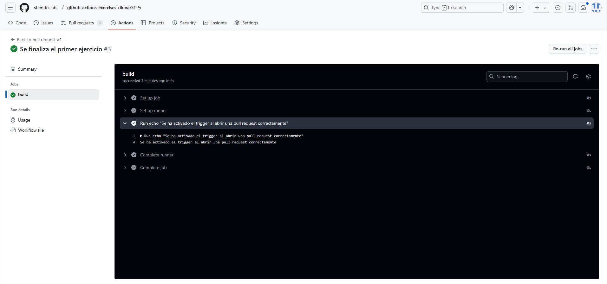

# Triggers - Ejercicio 1

## Configura un workflow para que se ejecute cuando se abre un Pull Request

Para poder hacer este ejercicio crearemos un nuevo `workflow` con el nombre `trigger_1.yaml` que contendrá lo siguiente:

```yaml
name: "Trigger de pull request en una rama - RLLM"

on:
  pull_request:
    types: [opened, synchronize, reopened]
jobs:
  build:
    runs-on: labs-runner
    steps:
      - run: echo "Se ha activado el trigger al abrir una pull request correctamente"
```

Como podemos ver los workflows en github siguen una estructura facil de entender.

El apartado `on` nos permite definir un trigger que en este caso es `pull_request` y los tipos de eventos que queremos que lo activen. En nuestro caso hemos definido tres tipos de eventos: `opened`, `synchronize` y `reopened`. Esto significa que el workflow se activará cuando se abra una nueva pull request, se sincronice una pull request existente o cuando se vuelva a abrir una pull request que se encuentre cerrada.

Una vez subido el ejercicio re-abriremos una pull request y veremos como se activa el workflow. En la pestaña de `Pull requests` podremos ver un mensaje indicandos que el workflow se ha ejecutado correctamente.


Si hacemos clic sobre el workflow podremos ver el resultado de la ejecución del mismo. Si hacemos clic sobre el paso podremos ver el resultado de la ejecución del mismo.



Con esto estaría todo terminado y habremos activado nuestro primer trigger.