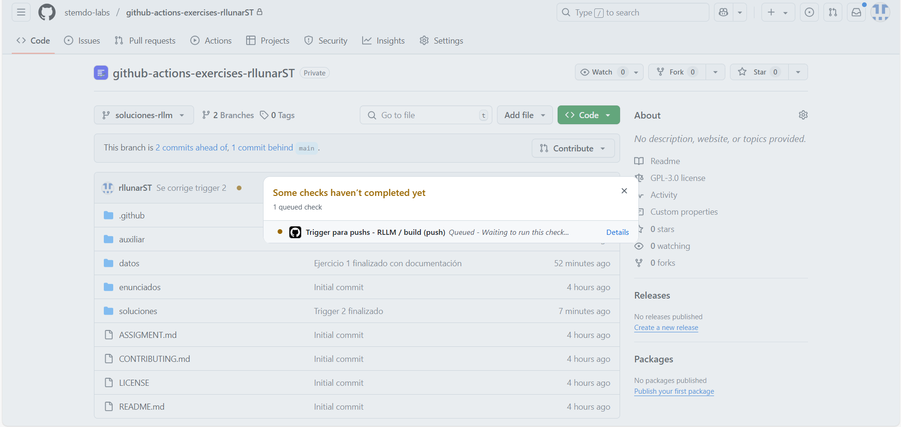
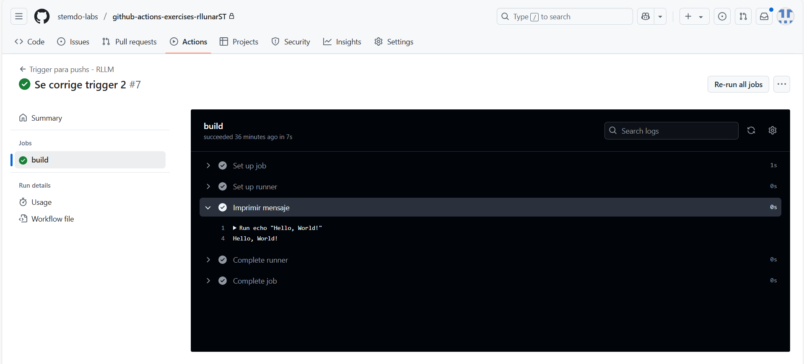

# Triggers - Ejercicio 2

## Configura un workflow para que se ejecute cuando se haga un push en la rama develop y simplemente imprima "Hello, World!" en la consola

Para poder hacer este ejercicio crearemos un nuevo `workflow` con el nombre `trigger_2.yaml` que contendrá lo siguiente:

```yaml
name: "Trigger para pushs - RLLM"

on:
  push:
    branches:
      - "soluciones-rllm"
jobs:
  build:
    runs-on: labs-runner
    steps:
      - name: Imprimir mensaje
      - run: echo "Hello, World!"
```

Como podemos ver este workflow es parecido al anterior pero en este caso el trigger es `push` que detectará si se hace push a la rama `soluciones-rllm`. 

Esto significa que el workflow se activará cuando se haga un `push` a la rama `soluciones-rllm`.

Haremos un push de prueba a la rama para comprobar su funcionamiento:



Como observamos al dirigirnos a nuestro repositorio y a la pestaña podemos ver que el workflow se ha ejecutado correctamente. Si hacemos clic sobre el workflow podremos ver cual workflow se ha ejecutado y si ha tenido éxito. Si hacemos clic sobre el paso podremos ver el resultado de la ejecución del mismo.



Con esto estaría todo terminado y habremos activado nuestro segundo trigger.