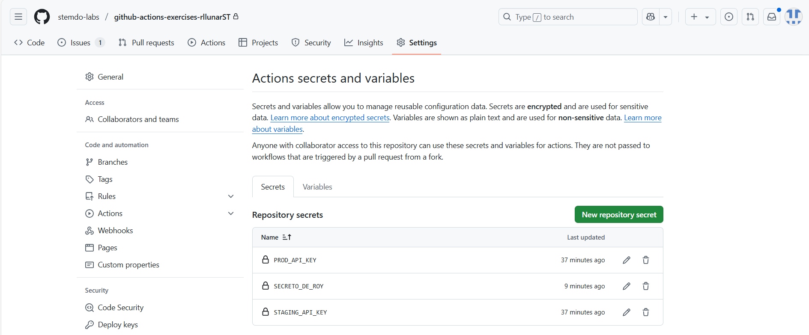

# Variables y Outputs - Ejercicio 2

## Configura un job que use un secreto definido en el repositorio (por ejemplo, MY_SECRET) y lo use en un comando.

Para este ejercicio vamos a crear otro workflow que use un secreto definido en el repositorio. Para ello, vamos a crear un nuevo archivo en la carpeta `.github/workflows` llamado `variables_2.yaml` y este tendrá el siguiente contenido:

```yaml
name: "Usando secretos - RLLM"

on:
  workflow_dispatch:

jobs:
  usar-secreto:
    runs-on: labs-runner
    steps:
      - name: Mostrando el mensaje con el secreto
        run: echo "Este es el secreto: ${{ secrets.SECRETO_DE_ROY }}"
```

Ahora creamos el secreto:



Ahora si hacemos la ejecución del workflow, veremos que el secreto se ha mostrado en la salida del job:


Como tal el secreto no se muestra, pero porque es un secreto y estos no se pueden mostrar en la consola.