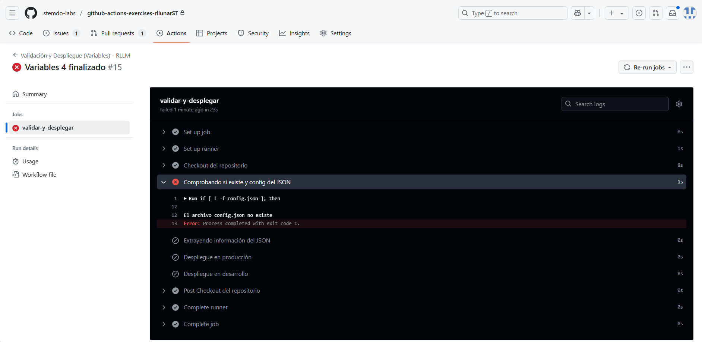
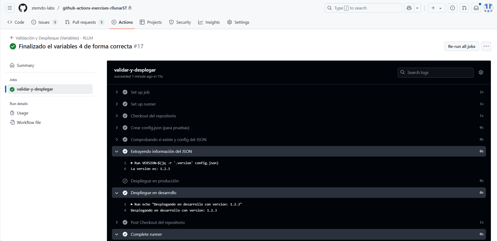

# Variables y Outputs - Ejercicio 4

## Configura un workflow que valide un archivo de configuración (config.json) y realice un despliegue condicional a develop o producción basado en la rama desde la cual se hace el push.

### Pasos:

- Verificar que el archivo config.json exista y que tenga el formato JSON válido.
- Extraer un valor específico del archivo config.json (por ejemplo, la versión de la aplicación) y utilizarlo como un output.
- Si el push se hace en la rama main, el workflow debería simular un despliegue de la aplicación en producción.
- Si el push se hace en una rama develop, el workflow debería simular un despliegue de la aplicación en develop.
- Si el archivo config.json no es válido, el workflow debería fallar y detenerse sin realizar el despliegue.

Para hacer este ejercicio debemos haces uso de varias condicionales para comprobar si el archivo existe y si el formato es correcto. También comprobamos si la rama es main o soluciones-rllm para desplegar en producción o en desarrollo. Como podremos ver a continuación el workflow deberá ser el siguiente:

```yaml
name: "Validación y Despliegue (Variables) - RLLM"

on:
  push:
    branches:
      - main
      - soluciones-rllm

jobs:
  validar-y-desplegar:
    runs-on: labs-runner

    steps:
      - name: Checkout del repositorio
        uses: actions/checkout@v4

      - name: Comprobando si existe y config del JSON
        id: validar_config
        run: |
          if [ ! -f config.json ]; then
            echo "El archivo config.json no existe"
            exit 1
          fi

          if ! jq empty config.json 2>/dev/null; then
            echo "El archivo config.json no tiene un formato valido"
            exit 1
          fi

      - name: Extrayendo información del JSON
        id: version
        run: |
          VERSION=$(jq -r '.version' config.json)
          echo "La version es: $VERSION"
          echo "version=$VERSION" >> $GITHUB_OUTPUT

      - name: Despliegue en producción
        if: github.ref == 'refs/heads/main'
        run: |
          echo "Desplegando en producción con version: ${{ steps.version.outputs.version }}"

      - name: Despliegue en desarrollo
        if: github.ref == 'refs/heads/soluciones-rllm'
        run: |
          echo "Desplegando en desarrollo con version: ${{ steps.version.outputs.version }}"
```

Sin embargo si lo ejecutamos dará error como podemos ver en la siguiente imagen:



Esto se debe a que no existe el fichero config.json

Para comprobar si funciona agregaremos al `variables_4.yaml` el siguiente contenido antes de comenzar con las comprobaciones:

```yaml
     - name: Crear config.json (para pruebas)
        run: echo '{"nombre": "Roy Lee Lunar","version":"1.2.3"}' > config.json
```

Esto nos permite crear el fichero `config.json` con datos como nombre y la versión.

Nuestro workflow ahora lucirá asi:

```yaml
name: "Validación y Despliegue (Variables) - RLLM"
on:
  push:
    branches:
      - main
      - soluciones-rllm

jobs:
  validar-y-desplegar:
    runs-on: ubuntu-latest

    steps:
      - name: Checkout del repositorio
        uses: actions/checkout@v4
    
      - name: Crear config.json (para pruebas)
        run: |
            echo '{"nombre": "Roy Lee Lunar","version":"1.2.3"}' > config.json

      - name: Comprobando si existe y config del JSON
        id: validar_config
        run: |
          if [ ! -f config.json ]; then
            echo "El archivo config.json no existe"
            exit 1
          fi

          if ! jq empty config.json 2>/dev/null; then
            echo "El archivo config.json no tiene un formato valido"
            exit 1
          fi

      - name: Extrayendo información del JSON
        id: version
        run: |
          VERSION=$(jq -r '.version' config.json)
          echo "La version es: $VERSION"
          echo "version=$VERSION" >> $GITHUB_OUTPUT

      - name: Despliegue en producción
        if: github.ref == 'refs/heads/main'
        run: |
          echo "Desplegando en producción con version: ${{ steps.version.outputs.version }}"

      - name: Despliegue en desarrollo
        if: github.ref == 'refs/heads/soluciones-rllm'
        run: |
          echo "Desplegando en desarrollo con version: ${{ steps.version.outputs.version }}"
```

Ahora si lo ejecutamos el workflow funcionará correctamente y nos mostrará el siguiente resultado:



