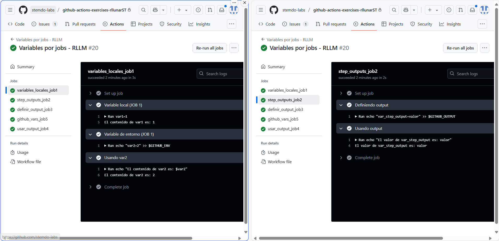
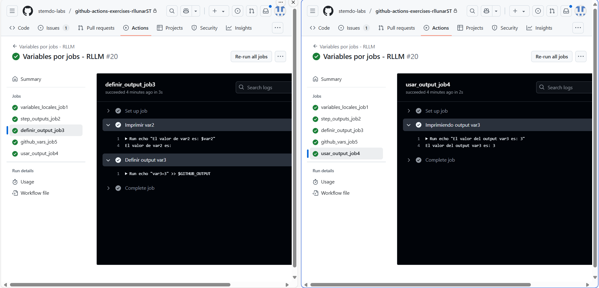
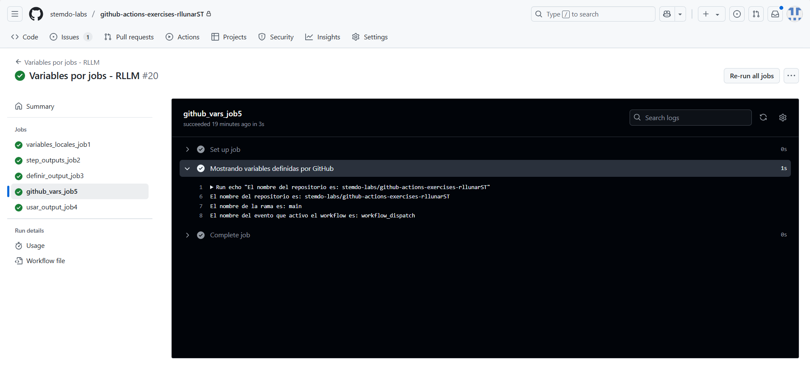

# Ejercicio 5

Variables entre pasos de un mismo job:

- Crea un job que:
  - Defina una variable local ``var1`` con valor 1 y la imprima.
  - Defina una variable ``var2`` usando el entorno de GitHub (``$GITHUB_ENV``) con valor 2.
  - Imprima el valor de ``var2`` en un paso diferente.

---
Compartir variables entre pasos usando outputs:

- Crea un job que:
  - Defina un output ``var_step_output`` con valor "valor".
  - Imprima el valor de ``var_step_output`` en un paso posterior.

---
Compartir variables entre jobs:

- Crea un job que:
  - Imprima el valor de ``var2`` y observa qué sucede.
  - Defina un output ``var3`` con valor 3 para compartir con otros jobs.

---
Imprimir variables entre jobs:

- Crea un job que dependa del anterior y:
  - Imprima el valor de ``var3`` definido en el job anterior.

---
Usar variables predefinidas de GitHub:

- Crea un job que imprima las siguientes variables predefinidas por GitHub:
  - Nombre del ``repositorio``.
  - Nombre de la ``rama``.
  - Nombre del ``evento`` que activó el workflow.

Para hacer este ejercicio dividiremos el fichero en multiples jobs:

```yaml
name: "Variables por jobs - RLLM"

on:
  workflow_dispatch:

jobs:
  variables_locales_job1:
    runs-on: ubuntu-latest
    steps:
      - name: Variable local (JOB 1)
        run: |
          var1=1
          echo "El contenido de var1 es: $var1"
      
      - name: Variable de entorno (JOB 1)
        run: echo "var2=2" >> $GITHUB_ENV

      - name: Usando var2
        run: |
          echo "El contenido de var2 es: $var2"

  step_outputs_job2:
    runs-on: ubuntu-latest
    steps:
      - name: Definiendo output
        id: paso1
        run: echo "var_step_output=valor" >> $GITHUB_OUTPUT

      - name: Usando output
        run: |
         echo "El valor de var_step_output es: ${{ steps.paso1.outputs.var_step_output }}"

  definir_output_job3:
    runs-on: ubuntu-latest
    outputs:
      var3: ${{ steps.setvar3.outputs.var3 }}
    steps:
      - name: Imprimir var2
        run: |
          echo "El valor de var2 es: $var2"

      - name: Definir output var3
        id: setvar3
        run: echo "var3=3" >> $GITHUB_OUTPUT

  usar_output_job4:
    needs: definir_output_job3
    runs-on: ubuntu-latest
    steps:
      - name: Imprimiendo output var3
        run: | 
          echo "El valor del output var3 es: ${{ needs.definir_output_job3.outputs.var3 }}"

  github_vars_job5:
    runs-on: ubuntu-latest
    steps:
      - name: Mostrando variables definidas por GitHub
        run: |
          echo "El nombre del repositorio es: ${{ github.repository }}"
          echo "El nombre de la rama es: ${{ github.ref_name }}"
          echo "El nombre del evento que activo el workflow es: ${{ github.event_name }}"
```

Como podremos ver en las imagenes a continuación tenemos los resultados de cada uno de los jobs:

### Job 1 y 2



Como podemos ver en la imagen anterior, el job 1 imprimimos la variable local ``var1`` y la variable de entorno ``var2`` y en el job 2 se imprime el output ``var_step_output`` que definimos en el job 2.

### Job 3 y 4



Como podremos ver en la imagen anterior, el job 3 no tiene acceso a la variable ``var2`` definida en el job 1, ya que no se ha definido como output. En el job 4 si podemos acceder a la variable ``var3`` ya que se ha definido como output en el job 3.

### Job 5



Como podemos ver en la imagen anterior, el job 5 imprime las variables predefinidas por GitHub. Estas variables son muy útiles para obtener información sobre el contexto en el que se está ejecutando el workflow.